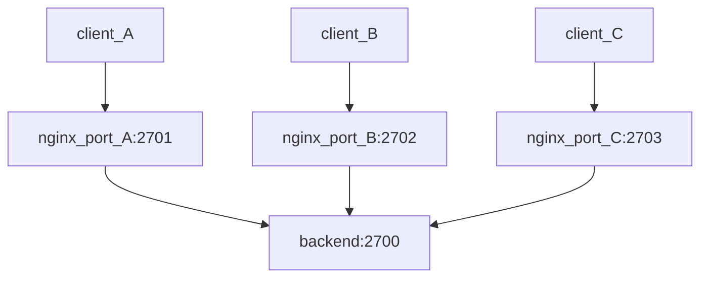

# nginx to limit backend connections
This is simple test with Docker Compose on how to use nginx to limit number of TCP connections to backend server.

In the sample case we have three clients, each using a separate port on the nginx. Nginx is forwarding the connections to the backend server.

As dummy backend we use https://github.com/cjimti/go-echo echo server. You can telnet to the server and it echoes whatever you write.

# Nginx configuration
For each client we define a separate shared memory pool for tracking the number of simultaneous connections (see nginx.conf)

    limit_conn_zone customer_connections zone=customer_a:1m;
    ...
    limit_conn customer_a 1;

the number "1" defines the max number of connections. 1m specifes the shared memory pool size in bytes.

It is also possible to enable "dry-run" mode. This does not actually block excessive connections, but logs the errors

# Logging
When max number of connections is reached, message like this is logged:

    nginx-test-nginx-1  | 2023/03/12 17:11:03 [error] 22#22: *9 limiting connections by zone "customer_b" while initializing session, client: 172.19.0.1, server: 0.0.0.0:2702

# Monitoring
Could not figure out how the individual "pools" could be monitored from nginx. Nginx stub_status can be used to create http endpoint which number of connections, but that is not separated per port. Using netstat or something similar to check the number of open connections per port is probably best option.

# Testing
Try opening two different telnet sessions to port 2701

    telnet localhost 2701 -> ok
    telnet localhost 2701 -> fails, error is logged

# References
Nginx documentation for stream limits:
    https://nginx.org/en/docs/stream/ngx_stream_limit_conn_module.html#variables

Nginx and Docker Compose inspiration:
    https://omarghader.github.io/docker-compose-nginx-tutorial/

----
Created 2023-03-12, Juha Palomäki, juhap@iki.fi